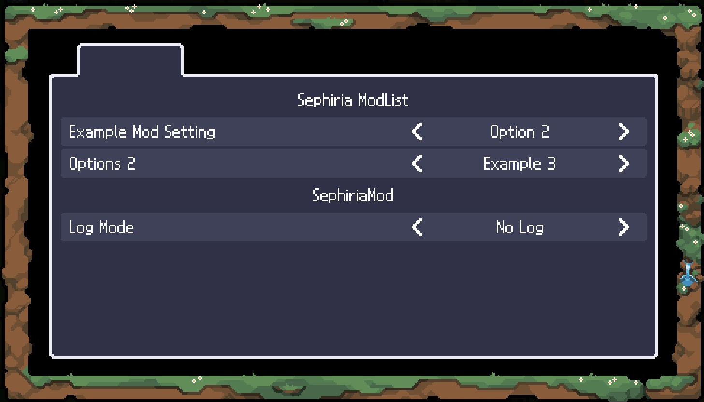

# SephiriaModList

## 📌 概要

Team Horay の <a href="https://store.steampowered.com/app/2436940/_/">Sephiria</a> にインストールされたMelonLoader Modに関する機能を追加します。

v0.1.0現在はMelonLoader Mod用の設定画面を追加します。
この機能に対応しているModの設定のみが画面に表示されます。
設定した内容はセーブデータに保存され、次の起動以降にも反映されます。



※このModは現在開発中であり、予期しない変更がある可能性があります。

## 📥 インストール
1. <a href="https://github.com/LavaGang/MelonLoader">MelonLoader v0.7.1</a> をSephiriaにインストールしてください。
2. Releases から最新の `SephiriaModList-0.X.X.zip` をダウンロードし、解凍してください。
3. `Program Files (x86)\Steam\steamapps\common\Sephiria\Mods` フォルダ内に `SephiriaModList.dll` を配置します。
4. ゲームを起動すると自動的に反映されます。

## 📝 注意事項
- このリポジトリおよびその貢献者は、Sephiria、Team Horay、または関連団体とは一切関係がありません

## 🔧 Mod開発者向け

### 設定の追加方法

`MelonMod`を継承したクラスに以下のプロパティおよび関数を加えてください。

- `public List<List<string>> ModOptions { get; }`<br>
各設定の選択肢。
- `public List<string> ModOptionsDescription { get; }`<br>
各設定の説明文。任意です。
- `public bool UseLocalizedSring { get; }`<br>
選択肢や説明文にLocalizedStringを使用するかどうか。任意です。デフォルトではfalseです。
- `public void OnModOptionChanged(int index, int value)`<br>
設定が変更された時に呼ばれる関数です。
- `public void OnModOptionLoaded(int index, int value)`<br>
ゲーム起動時にセーブデータから設定が読み込まれた時に呼ばれる関数です。

設定画面を閉じるとModの設定はすべて自動的に`C:\Users\{Your_PC_Name}\Documents\Saved Games\Sephiria\ModOptions.xml`に保存されます。これは起動時に自動的に読み込まれます。


例：
```csharp
        public List<List<string>> ModOptions => [["Option 1", "Option 2"], ["Example 1", "Example 2", "Example 3"]];

        public List<string> ModOptionsDescription => ["Example Mod Setting"];

        public void OnModOptionChanged(int index, int value)
        {

        }
        public void OnModOptionLoaded(int index, int value)
        {

        }
```